# Azusa

*A space archipelago waiting to be explored.*

> ⚠️ **Early development** — gameplay, mechanics and visuals are all subject to change.

## About

Azusa takes place in a world made of procedural islands floating in space (a "space archipelago"). At the center sits the Citadel, surrounded by scattered nomad islands. The core gameplay loop will revolve around exploring these islands and discovering the ruins and dungeons hidden within them.

## Devlog

### 1. Island Vegetation Distribution

Vegetation placement initially relied on pure Perlin noise, but this caused a lot of mesh clipping between plants. It was replaced with a jittered grid instead: each vegetation type has a "footprint" defining how many grid cells it occupies, which keeps placement dense and natural while avoiding overlap.

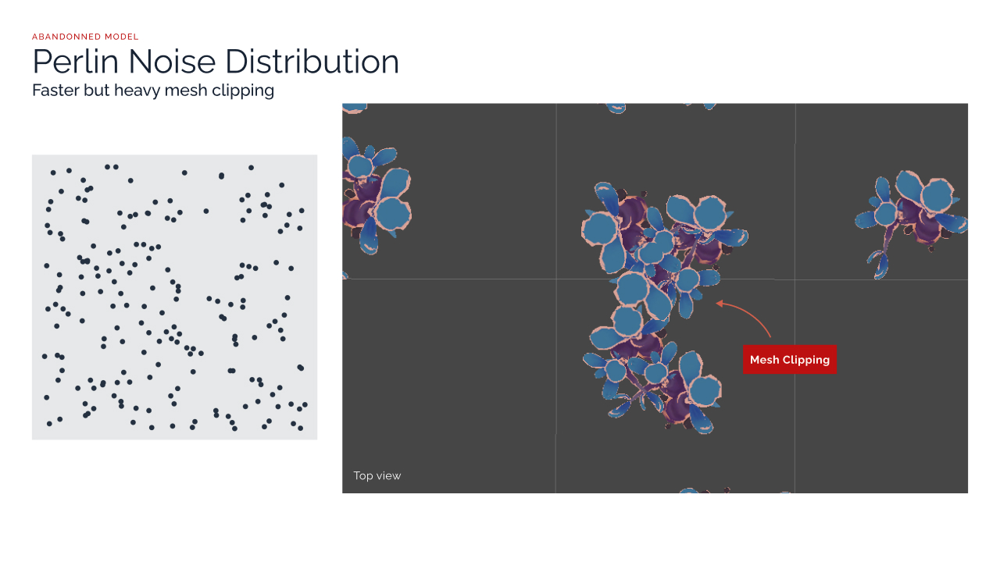
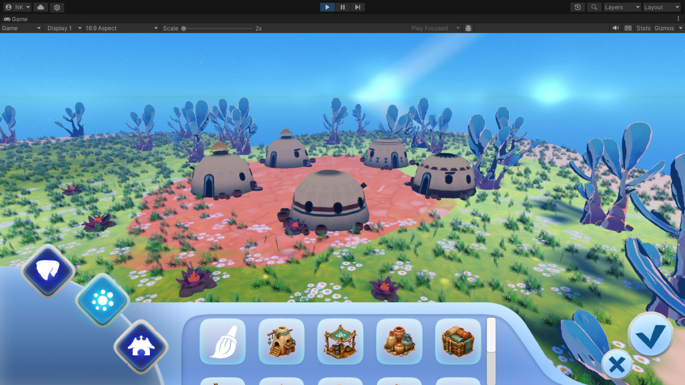
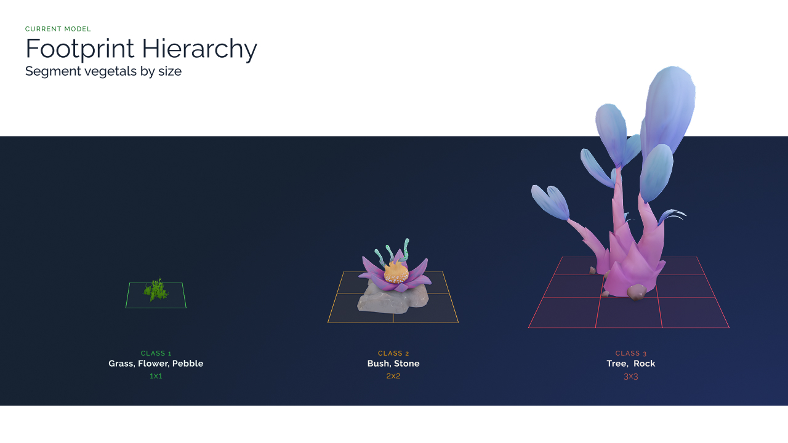
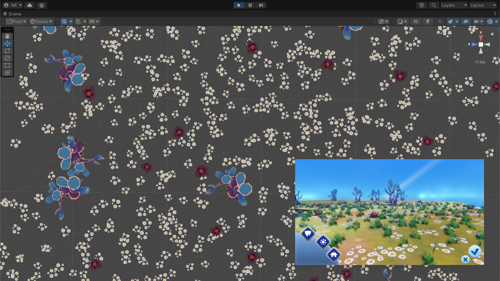

---

### 2. Nomad House Generation

Nomad house slots are procedurally generated by randomly placing wall and ground elements around a base structure. UV textures are also shifted per instance to add extra visual variation between houses.

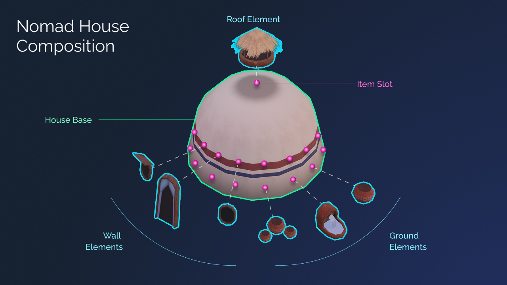
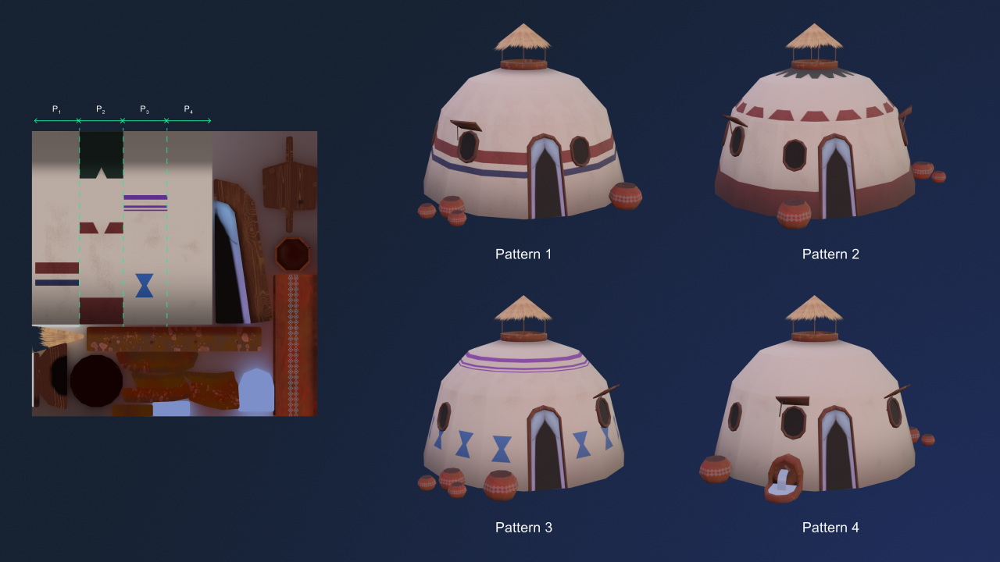

---

### 3. Island Generation

#### 3.1 Topology

Island shapes are built using square marching based on an array of circles, combined with Delaunay triangulation to form the base mesh. A weighted noise function is then applied to shape the ground.

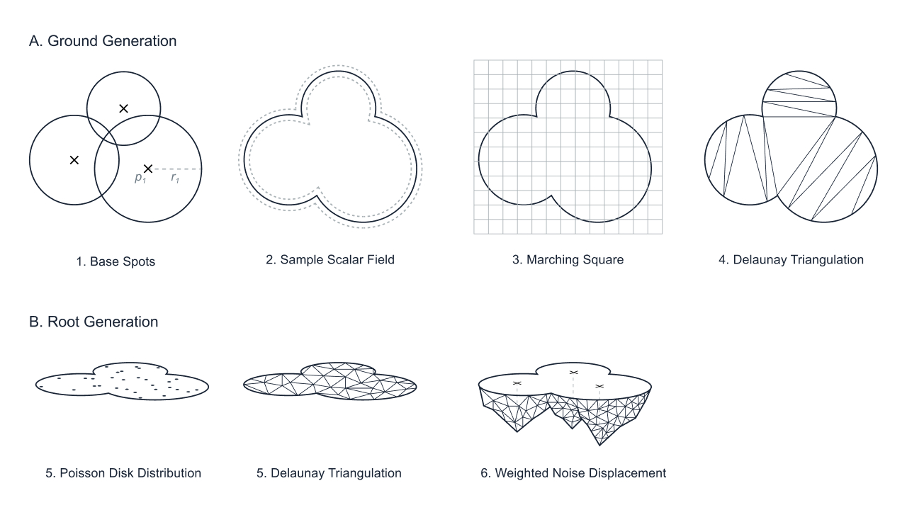

#### 3.2 Texturing

Textures are generated using Unity's orthographic projection to render masks. The island shape is shrunk down to create layered masks for sand (outer edge), grass, and mud (where nomad houses are placed).

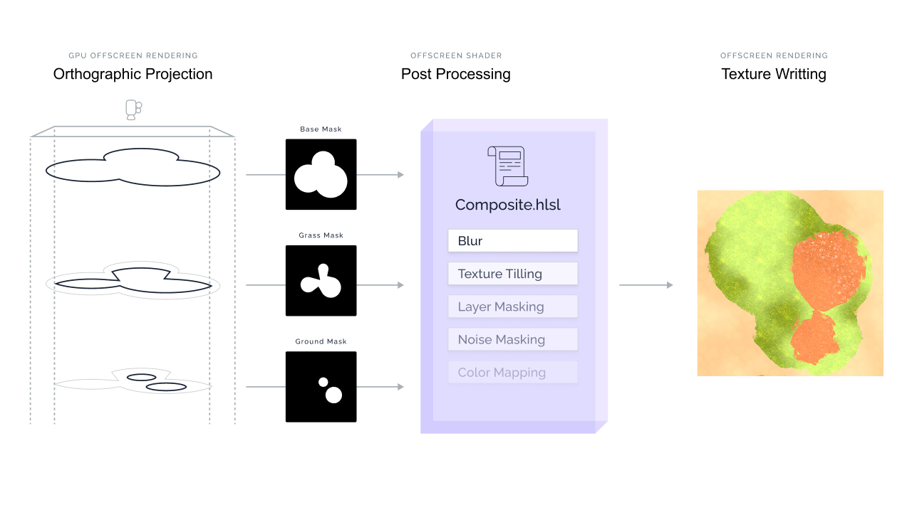
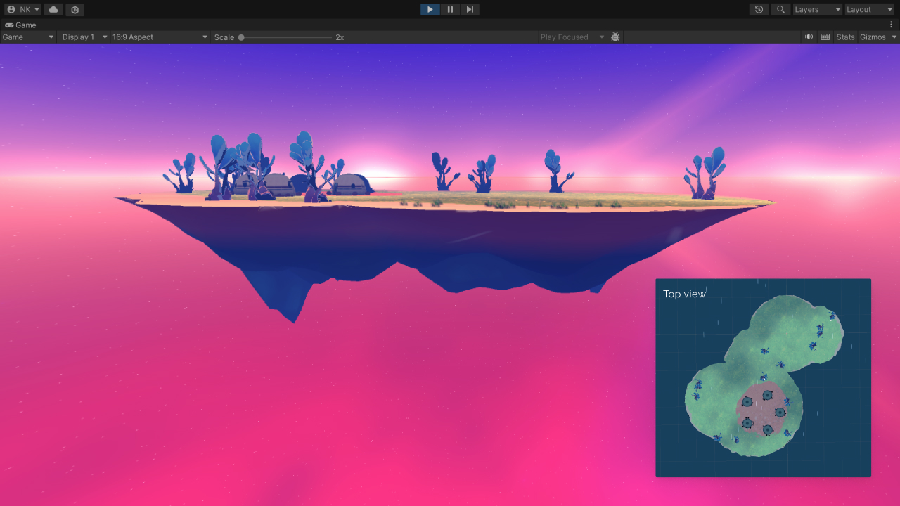

---

### 4. Props

A first batch of props was modeled to support the early mechanics and to help nail down the overall art direction.

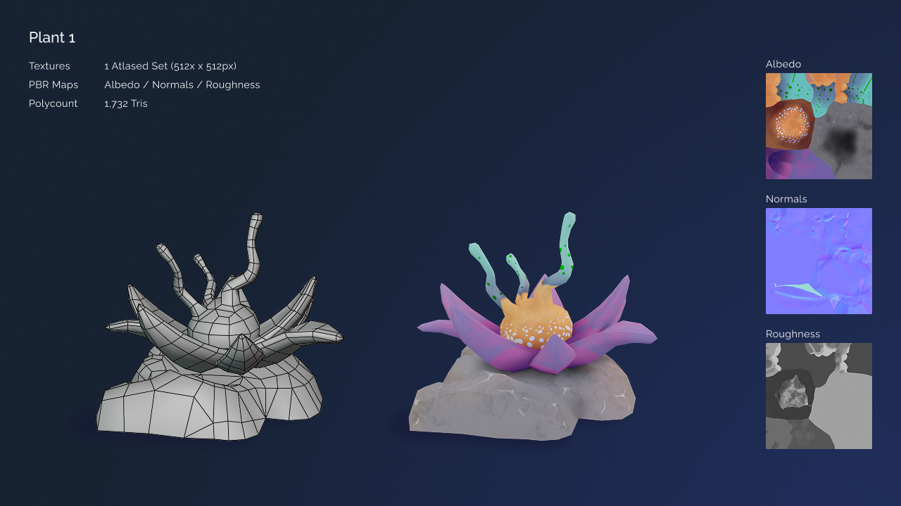

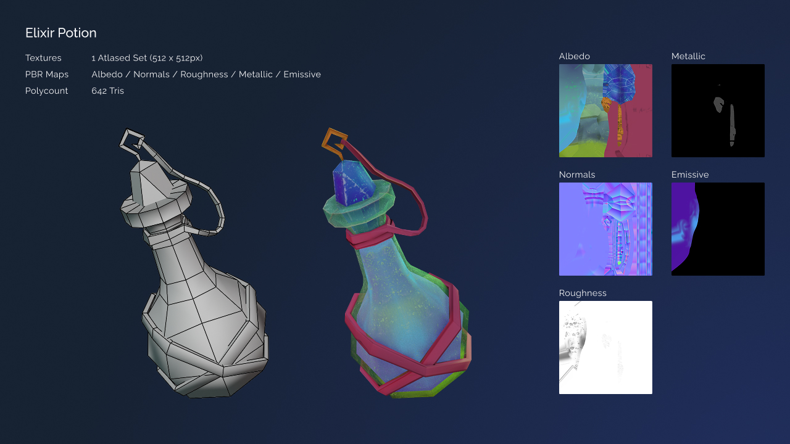
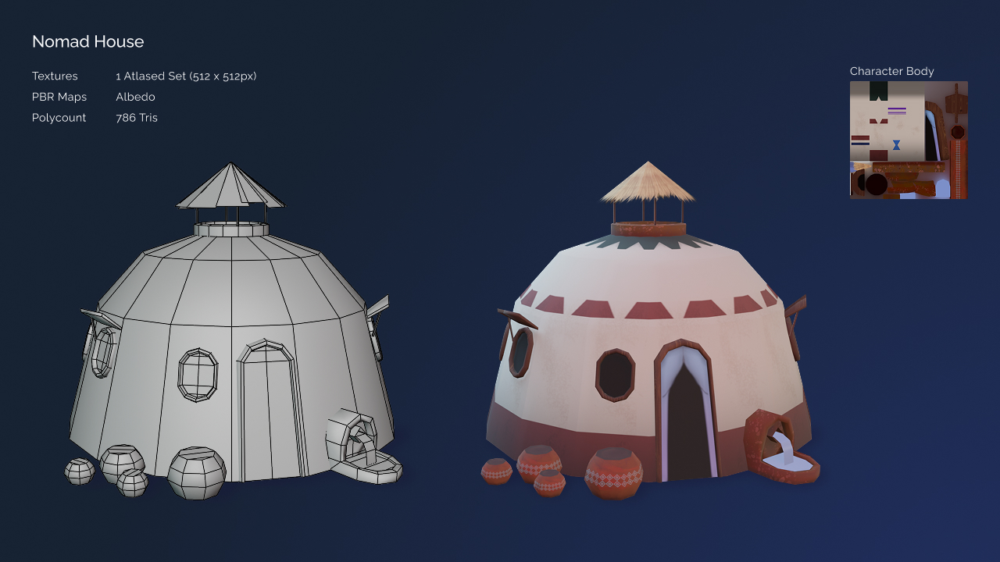
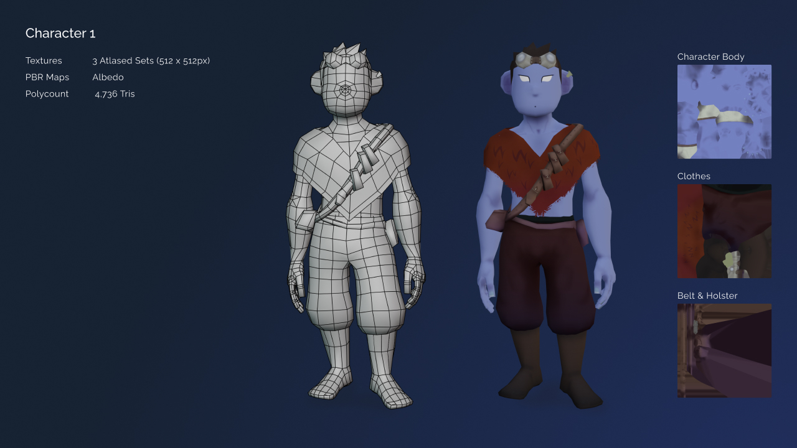
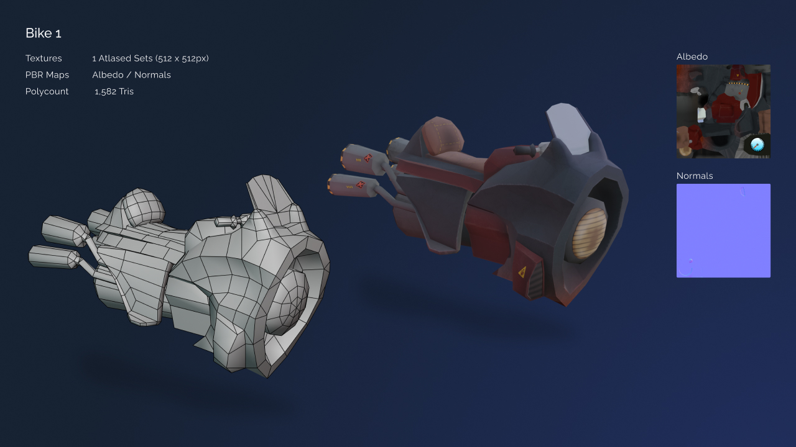
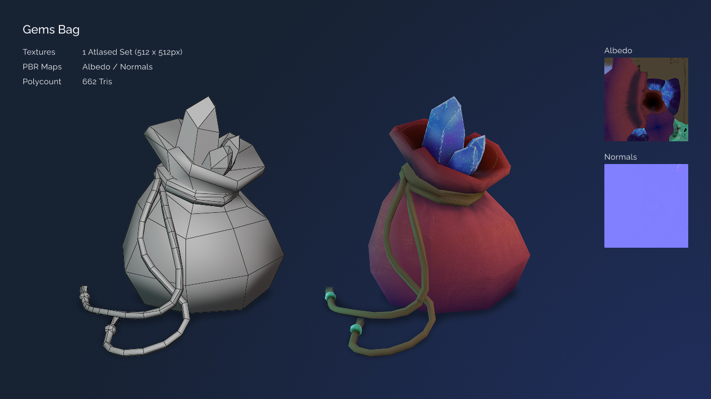
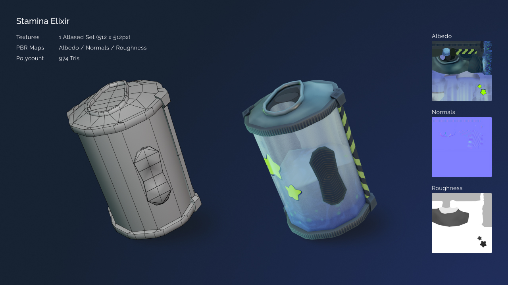
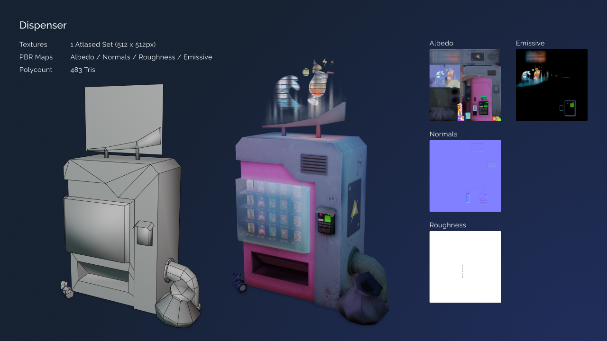
